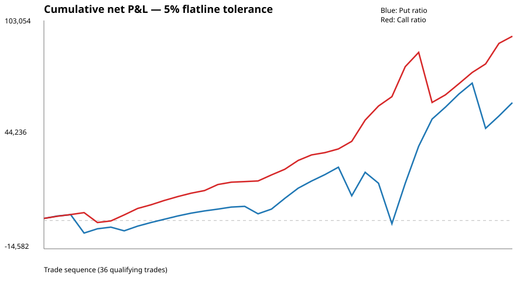
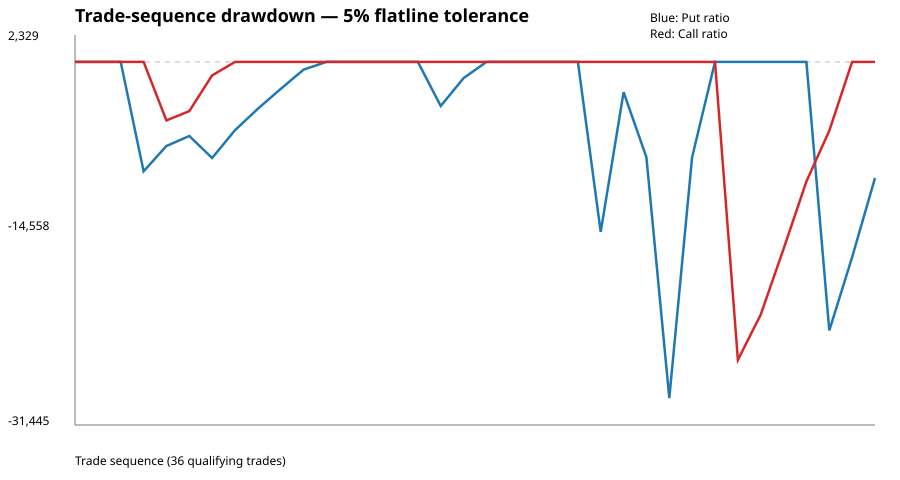

# Empirical study of 4-DTE NIFTY OTM4/OTM5/OTM6 ratio structures

## Abstract

This study evaluates two directional 1:-1:-1 NIFTY option structures: (1) long OTM4 put, short OTM5 put, short OTM6 put; and (2) the mirrored call structure. Entry occurs at 10:00 IST exactly four trading sessions before Tuesday expiry. The early-exit rule is the first time, at any point after entry and before expiry day, that the live combined P&L lies within a specified tolerance band around the expiry-payoff horizontal flatline. Otherwise the position exits at expiry.

A reproducible 1-minute OHLC backtest was executed using the Hugging Face NIFTY options dataset, historical lot sizes, date-dependent STT, exchange/SEBI/stamp/GST charges, ₹10 Paytm Money brokerage per executed order, and 0.05 option-point adverse slippage per leg. The executed dataset produced 36 qualifying trades per strategy from September 2025 through the 26-May-2026 expiry.

At 5% flatline tolerance, net P&L was ₹60,711.67 for the put ratio and ₹94,941.36 for the call ratio. Net win rates were 80.56% and 94.44%, respectively. Maximum trade-sequence drawdowns were ₹29,116.18 and ₹25,810.14. Tolerance and slippage sensitivity were tested. These are descriptive historical findings, not forecasts; incomplete source coverage after 26-May-2026 and lack of historical bid/ask data are important limitations.

## 1. Research question
What historical performance is produced by the two OTM4/OTM5/OTM6 1:-1:-1 NIFTY option structures when entered at 10:00 IST four trading sessions before Tuesday expiry and exited either at the first pre-expiry flatline-proximity event or at expiry?

## 2. Hypotheses
H1: The flatline-proximity exit rule produces a distribution of realized P&L materially different from holding every trade to expiry.
H2: Performance statistics are sensitive to the numerical definition of close to the flatline.
H3: Execution slippage changes both the exit path and realized net P&L.

## 3. Strategy definition
### Strategy 1
Buy OTM4 PE; sell OTM5 PE; sell OTM6 PE.

### Strategy 2
Buy OTM4 CE; sell OTM5 CE; sell OTM6 CE.

OTM4/5/6 are the fourth, fifth and sixth listed OTM strikes from the 10:00 ATM reference.

### Entry
Exactly four trading sessions before Tuesday expiry, at 10:00 IST.

Wednesday 4 DTE -> Thursday 3 -> Friday 2 -> Monday 1 -> Tuesday 0.

### Early exit
Let F be the expiry payoff flatline and H be the bump height. Exit at the first post-entry observation before expiry day satisfying abs(Live P&L - F) <= T * H, with T tested at 2%, 5% and 10%. There is no prerequisite movement into the profit bump.

### Expiry exit
If no flatline-proximity event occurs before expiry day, exit at the final tradable observation on expiry day.

## 4. Payoff derivation
For equal strike spacing d, the expiry payoff has a horizontal flatline, a finite maximum-profit plateau between the two short strikes, and an unbounded adverse tail.

For the put ratio K4 > K5 > K6: S >= K4 is the flatline; K5 <= S < K4 is the rising segment; K6 <= S < K5 is the maximum-profit plateau; S < K6 is the adverse tail. The call structure is the mirror image.

If C0 = long premium - short premium(K5) - short premium(K6), then Flatline = -C0, Maximum profit = d - C0, and bump height = d.

## 5. Data
Primary data source: Hugging Face dataset thetrademarkk/india-index-options-1m. The dataset is 1-minute OHLCV/OI data and is licensed CC BY-NC 4.0. Raw licensed files were downloaded in GitHub Actions using HF_TOKEN and cached rather than copied into this public repository.

The executed run selected NIFTY expiry files between 02-Sep-2025 and 04-Aug-2026. However, the actual qualifying spot/option sample ended at the 26-May-2026 expiry. Later dates are not treated as zero-return observations.

## 6. Execution and transaction costs
- Brokerage: ₹10 per executed F&O order.
- Six executed option orders per completed trade.
- Adverse slippage: 0.05 points per leg.
- NIFTY lot size: 75 through 30-Dec-2025; 65 from 06-Jan-2026.
- STT: 0.10% before 01-Apr-2026 and 0.15% from 01-Apr-2026.
- Exchange turnover rate: 0.0003553.
- SEBI turnover rate: 0.000001.
- Stamp duty on option purchase premium: 0.00003.
- GST: 18%.

The historical Paytm Money brokerage rate can depend on account vintage; ₹10 is the reference assumption and brokerage sensitivity remains necessary for a user-specific implementation.

## 7. Backtest methodology
1. Determine eligible expiry and four-session entry date.
2. Use only the 10:00 spot observation to identify ATM.
3. Select OTM4/5/6.
4. Apply adverse entry slippage.
5. Calculate flatline and bump height.
6. Monitor combined three-leg P&L after the entry bar.
7. Apply the flatline-proximity condition before expiry day.
8. Otherwise exit at expiry.
9. Apply exit slippage and dated transaction costs.
10. Store trade-level results.

No future price is used to choose strikes or determine the entry.

## 8. Results — reference case

| Metric | Put ratio | Call ratio |
|---|---:|---:|
| Trades | 36 | 36 |
| Net P&L | ₹60,711.67 | ₹94,941.36 |
| Mean net P&L/trade | ₹1,686.44 | ₹2,637.26 |
| Median net P&L/trade | ₹1,785.07 | ₹2,871.44 |
| Net win rate | 80.56% | 94.44% |
| Profit factor | 1.762 | 4.074 |
| Max drawdown | -₹29,116.18 | -₹25,810.14 |
| Worst trade | -₹23,264.52 | -₹25,810.14 |
| Best trade | ₹20,852.30 | ₹15,485.89 |
| Flatline exits | 44.44% | 55.56% |
| Expiry exits | 55.56% | 44.44% |
| Estimated costs | ₹3,799.58 | ₹3,748.14 |

## 9. Flatline-tolerance sensitivity

| Tolerance | Put net P&L | Call net P&L |
|---:|---:|---:|
| 2% | ₹63,025.61 | ₹85,885.02 |
| 5% | ₹60,711.67 | ₹94,941.36 |
| 10% | ₹57,864.12 | ₹88,042.15 |

The exit frequency changes substantially with tolerance. Therefore close-to-flatline is a material strategy parameter.

## 10. Slippage sensitivity

| Slippage/leg | Put net P&L | Call net P&L |
|---:|---:|---:|
| 0.00 | ₹61,356.48 | ₹93,592.27 |
| 0.05 | ₹60,711.67 | ₹94,941.36 |
| 0.10 | ₹60,233.32 | ₹94,303.57 |

Because slippage affects both entry economics and the live exit trigger, the effect is path-dependent.

## 11. Statistical analysis
Nonparametric bootstrap results for mean net P&L per trade: put ratio ₹1,686.44 with 95% CI -₹1,223.75 to ₹4,427.21; call ratio ₹2,637.26 with 95% CI ₹488.43 to ₹4,375.33.

For paired call-minus-put P&L, the mean difference was ₹950.82 per trade, with 95% bootstrap CI -₹2,560.10 to ₹4,278.95. The two-sided Wilcoxon signed-rank test gave p = 0.681. The paired sample therefore does not provide strong statistical evidence that the observed difference generalizes beyond this sample.

## 12. Discussion
The central empirical observation is that the flatline-proximity rule creates a large distinction between early exits and expiry exits. At 5% tolerance, approximately 44% of put trades and 56% of call trades exited before expiry day.

The strategy remains exposed to the structural tail risk of a 1:-1:-1 ratio. The large maximum losses in the sample demonstrate that a high win rate does not eliminate tail risk.

The results are sensitive to tolerance. A tighter 2% band produced more expiry exits, while a wider 10% band produced more early exits, especially for the call structure.

The call and put structures had different empirical P&L distributions in this sample, but the paired statistical comparison was not conclusive.

## 13. Strengths
- User-confirmed entry and exit rules implemented directly.
- Four-trading-session DTE explicit.
- Early exit checked from the first post-entry bar.
- No prior movement into the bump required.
- Historical lot-size changes incorporated.
- Dated STT incorporated.
- Brokerage, statutory charges and slippage included.
- Trade-level outputs retained.
- Tolerance and slippage sensitivity tested.
- CI execution reproducible.

## 14. Limitations
1. Only 36 qualifying trades were obtained for the executed sample.
2. Source coverage after 26-May-2026 was not sufficient to claim the full requested period.
3. Public data provide OHLC rather than historical bid/ask quotes.
4. Fixed slippage is a proxy for execution.
5. No margin/capital model is used, so capital-return metrics are not reported.
6. No independent out-of-sample validation has yet been performed.
7. Adjacent expiry observations may not be statistically independent.
8. The tolerance was defined by sensitivity analysis rather than preregistered externally.
9. The strategy has unbounded theoretical adverse-tail exposure.

## 15. Conclusion
Within the executed September-2025-to-May-2026 sample and stated execution assumptions, both ratio structures generated positive aggregate net P&L. The call-ratio structure produced ₹94,941.36 versus ₹60,711.67 for the put-ratio structure in the 5% reference run, but the paired statistical comparison did not establish a statistically reliable difference between them.

The results support treating the strategy as a research candidate rather than as a validated trading system. The most important unresolved questions are source coverage, out-of-sample performance, realistic quote-level execution, margin requirements and regime dependence.

## 16. Future research
1. Complete data-coverage audit for every Tuesday expiry after 26-May-2026.
2. Add a second independent intraday data source for cross-validation.
3. Reconstruct historical bid/ask execution where available.
4. Test Paytm Money brokerage-vintage scenarios.
5. Add margin and capital-utilization modelling.
6. Segment by volatility, trend, gap, skew and market regime.
7. Test FII/DII flows, global-market overnight moves, VIX/India VIX, gold and cross-asset signals as explanatory variables.
8. Add corporate actions and event/news filters where relevant.
9. Reserve a genuinely out-of-sample period.
10. Pre-register tolerance and slippage parameters before the final out-of-sample test.

## 17. Reproducibility
- [Research plan](RESEARCH_PLAN.md)
- [Strategy definition](STRATEGY_DEFINITION.md)
- [Empirical results](results/PHASE2_PHASE6_RESULTS.md)
- [Statistical analysis](results/STATISTICAL_ANALYSIS.md)
- [5% Strategy 1 trade log](results/phase2_5pct_strategy1.csv)
- [Equity chart](results/equity_curve_5pct.svg)
- [Drawdown chart](results/drawdown_5pct.svg)
- [Phase 2 workflow](../.github/workflows/phase-2-backtest.yml)
- [Tolerance robustness workflow](../.github/workflows/phase-6-robustness.yml)
- [Slippage robustness workflow](../.github/workflows/phase-6-slippage.yml)